# Caisson launch-act runbook

Operator-executed, external-system/data-migration work. This runbook does not authorize an agent
to deploy, migrate, rotate secrets, publish, remove access gates, or accept money without the
corresponding hold being released.

## Current pre-launch posture

- Railway runs site, admin, demos, license, docs-RAG, and support-bot; Cloudflare runs the
  registry Worker.
- Marketing, docs, marketplace, and public APIs are public.
- `/dashboard*` and `/cart*` remain Cloudflare Access gated. Checkout remains sandbox-only.
- Admin uses in-app GitHub OAuth plus immutable numeric-user-ID allowlisting **and**, since PR
  #448 / **ADR-0415**, a Cloudflare Access requirement in `apps/admin` itself. The serving revision
  has carried that requirement since the #464 carve unfroze deploys (2026-08-27), but Access is
  not fronting `admin.caisson.sh` yet (deferred to the Wave-5 edge sequencing), so every non-probe
  admin route refuses — the CAISSON-208 residual in outstanding-work.
- Paddle is the sole merchant of record. The catalog is six bundles and 27 modules; production
  recreation is **36 products and 68 prices**.
- Compliance is **$1,649** and Everything is **$2,259** (ADR-0383/0384). This runbook does not
  reopen pricing.
- WORM remains GOVERNANCE pre-launch; launch requires a receipted forward-only COMPLIANCE
  escalation.
- Index parity was last recorded **OK** on 2026-08-01 (repository, license, Worker and admin at
  `dc5ee000aebf` over 54 entries). That reading predates the 2026-09-16 version cut (#487), whose
  47 tarballs are unpublished, so the repository index now leads the Worker until the next release
  train. Docs/support parity stays uncertified (both are private services behind a Turnstile-gated
  proxy, so no automatable receipt exists). Site migrations `0030`–`0033` are applied and receipted
  (2026-07-27 and 2026-07-29 — see [deploy state](../deploy/STATE.md)).

## Binding execution order

```mermaid
flowchart LR
    A["Wave 1 safety fixes"] --> B["Preliminary one-SHA fleet + migrations through 0032"]
    B --> C["Locked product gaps + three adapters"]
    C --> D["Full gates + version PR"]
    D --> E["Immutable tag + exact-byte publish"]
    E --> F["Final tag-based fleet parity"]
    F --> G["Four technical receipts + auditors"]
    G --> H["Paddle + Ring-3 + business gates"]
    H --> I["Paid/public launch"]
```



The preliminary fleet reconciliation proves the current safety source and applies the migration
chain through `0032_field_crypto_keys.sql` — executed 2026-07-27 (T4 in outstanding-work; `0033`
followed on 2026-07-29), so Act 1 is a completed record kept as the procedure for any re-run. The
final fleet reconciliation proves the
immutable release tag. Paid/public launch is always after the release and final parity receipt.

## Act 1 — preliminary one-SHA fleet and migration

Preconditions:

- [ ] ADR-0379 truth, dependency, price, and limiter wave is committed and locally green.
- [ ] Exact source SHA, rollback SHA, service targets, migration order, and rollback procedure are
      written into the execution receipt.
- [ ] Railway backup recency is verified and the logical restore procedure is ready.
- [ ] The external-system/data-migration hold is explicitly released.
- [ ] Every launch-critical variable below is present on its service. Check this before the deploy,
      not after — several fail only after a clean boot and green deploy probe.

### Fleet fail-soft configuration seams

These are the eight enumerated feature gates that can survive a clean boot and then degrade only
when the feature is used. The two admin mutation paths share one credential pair and therefore one
arming row.

| Seam                                          | Service         | Variables                                                                                                                                                                                  | Launch class                               | Real degraded behavior when absent                                                                                                                                                                                                                                                                                                                                                                                                                                                                                                                                                                                                                                                        | Arming action                                                                                                                                                                                             |
| --------------------------------------------- | --------------- | ------------------------------------------------------------------------------------------------------------------------------------------------------------------------------------------ | ------------------------------------------ | ----------------------------------------------------------------------------------------------------------------------------------------------------------------------------------------------------------------------------------------------------------------------------------------------------------------------------------------------------------------------------------------------------------------------------------------------------------------------------------------------------------------------------------------------------------------------------------------------------------------------------------------------------------------------------------------- | --------------------------------------------------------------------------------------------------------------------------------------------------------------------------------------------------------- |
| `site.ask-ai-docs-retrieval`                  | `caisson-site`  | `DOCS_SERVICE_TOKEN` + `DOCS_QUERY_URL`                                                                                                                                                    | **REQUIRED**                               | Docs retrieval raises “not configured”; `/api/ask` emits `retrieval_unavailable` and the buyer gets the escalation/contact path instead of an answer (`apps/site/lib/ask-ai/retrieve.ts:62`, `apps/site/lib/ask-ai/handler.ts:210-216`).                                                                                                                                                                                                                                                                                                                                                                                                                                                  | Probe both names and record the receipt; no arming record existed on `caisson-site` as of 2026-07-26.                                                                                                     |
| `site.ask-ai-generation`                      | `caisson-site`  | `OPENROUTER_API_KEY`                                                                                                                                                                       | **REQUIRED**                               | Retrieval may succeed, but generation raises “openrouter is not configured”; `/api/ask` emits `generation_failed` and falls back to escalation/contact (`apps/site/lib/ask-ai/openrouter.ts:70`, `apps/site/lib/ask-ai/handler.ts:210-216`).                                                                                                                                                                                                                                                                                                                                                                                                                                              | Probe and record the receipt.                                                                                                                                                                             |
| `site.subscription-cancellation`              | `caisson-site`  | `PADDLE_API_KEY`                                                                                                                                                                           | **REQUIRED**                               | An owned active subscription cannot be scheduled for cancellation: the Paddle adapter returns `cancellation is not configured` and the route maps the failure to HTTP 502 (`apps/site/lib/paddle-cancel.ts:42`, `apps/site/lib/subscription-cancel.ts`).                                                                                                                                                                                                                                                                                                                                                                                                                                  | Probe and record the receipt.                                                                                                                                                                             |
| `site.paddle-checkout`                        | `caisson-site`  | `NEXT_PUBLIC_PADDLE_CLIENT_TOKEN`                                                                                                                                                          | **REQUIRED**                               | Paddle never initializes; purchase and renewal controls are disabled as **Checkout unavailable**, so no checkout overlay opens (`apps/site/lib/paddle-checkout.ts:141`, `apps/site/components/cart-checkout-panel.tsx:175-179`, `apps/site/components/plan-purchase-row.tsx:132-136`, `apps/site/components/updates-window-card.tsx:111-115`).                                                                                                                                                                                                                                                                                                                                            | Probe and record the receipt.                                                                                                                                                                             |
| `site.byok-field-crypto`                      | `caisson-site`  | `AZURE_KEY_VAULT_URL` + `AZURE_KEY_VAULT_KEY_NAME` + `AZURE_KEY_VAULT_WRAP_ALGORITHM` + `AZURE_KEY_VAULT_PURGE_PROTECTION` + `AZURE_TENANT_ID` + `AZURE_CLIENT_ID` + `AZURE_CLIENT_SECRET` | **REQUIRED**                               | **Deferred throw, not a boot failure.** The site starts clean and passes every deploy probe; the first buyer BYOK submit then throws, because production never falls back from Azure KMS to the derived provider or the demo vector. The wrap algorithm must be `RSA-OAEP-256`, the purge-protection sentinel must be `enabled`, and the live key's recovery level must prove purge protection (`apps/site/lib/field-crypto-kms.ts`). All three service-principal names are required and validated: the runtime constructs an explicit `ClientSecretCredential`, so a missing or misspelled one fails closed at construction rather than silently probing an ambient identity (ADR-0392). | Probe all seven names, verify vault purge protection and the principal's key permissions, run a real wrap/unwrap probe, and record every check in the execution receipt. **No arming record exists yet.** |
| `site.authentication-runtime`                 | `caisson-site`  | `DATABASE_URL` + `BETTER_AUTH_SECRET`                                                                                                                                                      | **REQUIRED**                               | Better Auth resolves to a null runtime; auth endpoints return HTTP 503 and session reads behave unauthenticated while the public site can remain up (`apps/site/lib/auth-server.ts:240-256`).                                                                                                                                                                                                                                                                                                                                                                                                                                                                                             | Probe both names and record the receipt.                                                                                                                                                                  |
| `admin.license-reissue-and-affiliate-minting` | `caisson-admin` | `CAISSON_LICENSE_ISSUE_URL` + `ADMIN_ISSUE_TOKEN`                                                                                                                                          | **REQUIRED**                               | License reissue and affiliate minting both throw “not configured” before their mutation/audit rows are written (`apps/admin/src/lib/admin-mutations-runtime.ts`: `licenseServiceProxy`, `issueProxy`, and `mintDiscountProxy`).                                                                                                                                                                                                                                                                                                                                                                                                                                                           | Probe both names on `caisson-admin` and record the receipt.                                                                                                                                               |
| `admin.catalog-test-email-recipient`          | `caisson-admin` | `CATALOG_TEST_EMAIL_TO`                                                                                                                                                                    | **OPTIONAL — operator-only test delivery** | The operator-only catalog test-email endpoint returns HTTP 503 and sends no test message; buyer email delivery does not depend on this recipient (`apps/admin/src/app/api/admin/catalog/send-test-email/route.ts:59`).                                                                                                                                                                                                                                                                                                                                                                                                                                                                    | Absence is acceptable for launch, but the probe must report it as optional and missing.                                                                                                                   |

`PADDLE_ENV` and `NEXT_PUBLIC_PADDLE_ENV` are selectors, not fail-soft gates: when absent they
default to sandbox rather than silently disabling the corresponding feature. They are deliberately
outside this presence inventory.

`SESSION_TOKEN_HMAC_KEY` remains a separate **fail-hard** `caisson-site` prerequisite. Its absence
throws during auth runtime construction instead of degrading silently
(`apps/site/lib/auth-server.ts:151,265`; armed receipt: the **2026-07-19 (late PM) — Full fleet
redeploy at `655bb26a`: hash-at-rest live** entry in [deploy state](../deploy/STATE.md)). Cited by
heading, not line: `STATE.md` is a reverse-chronological prepend-only log, so every new entry shifts
every line number below it — this reference had already drifted onto a table separator.

#### BLOCKING preflight — `tenant_ai_credential` must be empty before Azure KMS is armed

Arming Azure KMS is a **one-way door**. Production previously sealed `tenant_ai_credential` with
`DerivedKeyProvider` at key version 1, and a freshly provisioned KMS tenant is also numbered
version 1. The ADR-0046 envelope records only the version, so it cannot tell the two providers
apart: any row written before the cutover decrypts afterwards as an AES-GCM tag failure
**indistinguishable from tampering**. There is no rewrap helper, and BYOK ciphertext has no
recovery path.

The wave scoped re-encryption out on the premise that nothing is sealed yet. That premise is an
assertion, not a fact — nothing in the code verifies it. Verify it here, before arming.

**A bare `SELECT count(*)` is NOT a valid check and must never be used for this.**
`tenant_ai_credential` carries `FORCE ROW LEVEL SECURITY` with a policy keyed on
`app.current_account`. Without that GUC set, the count returns **0 even when rows exist** — for an
ordinary role _and_ for the table owner, because the policy is FORCEd. The repository's own RLS
suite pins exactly this behavior (`packages/tenancy-rls/src/rls.integration.test.ts`, "code that
forgets withTenant entirely sees nothing"). A naive count here returns a false green and the next
step destroys buyer data.

Run the check so that insufficient privilege **errors** instead of silently filtering:

```sql
-- 1. Prove the role can actually see through RLS. EITHER column suffices — superusers bypass every
--    policy regardless of the catalog bit, and BYPASSRLS grants it explicitly. Requiring both would
--    send you to escalate a production role to SUPERUSER to satisfy a rule Postgres does not impose.
SELECT rolsuper, rolbypassrls, rolsuper OR rolbypassrls AS bypasses_rls
FROM pg_catalog.pg_roles
WHERE rolname = current_user;

-- 2. Count with row security off. Session-level SET, deliberately NOT `SET LOCAL`: run outside a
--    transaction block `SET LOCAL` emits a WARNING and takes no effect, the count then silently
--    filters to 0, and that is the exact false green this whole step exists to kill. Postgres
--    ERRORS here if the role cannot bypass RLS, which is the point: a failure is loud, a filtered
--    zero is not. Schema-qualified so a leftover temp/private relation of the same name in an
--    earlier `search_path` entry cannot be counted instead.
SET row_security = off;
SELECT count(*) AS sealed_rows FROM public.tenant_ai_credential;  -- MUST be 0
RESET row_security;
```

- **0 rows, with `bypasses_rls` true** — proceed, and record both the role capabilities and
  the count in the execution receipt. A count without its accompanying privilege proof is not a
  receipt.
- **Any error, or `bypasses_rls` false** — STOP. You have not measured anything.
- **Any `WARNING: SET LOCAL can only be used in transaction blocks`** (if you adapted the block) —
  STOP. The count that followed it was filtered, not measured.
- **Non-zero** — STOP. Do not arm Azure. Either truncate the table as part of the migration-0032
  step (BYOK is write-only per ADR-0183, so buyers simply re-submit their keys), or start the KMS
  version chain above the derived registry's high-water mark. Choosing silently is data loss.

Blast radius is currently bounded only by the fact that `getTenantProviderKey` has no caller in
`apps/site`, so nothing reads the column yet. That is luck, not a guard, and it stops being true
the moment a read path ships.

#### Named configured-probe step — fleet fail-soft inventory

Run the existing Railway-side launch preflight in configured-probe mode:

```bash
bun tooling/scripts/railway-env-sync.ts --configured-probe
```

This mode checks every deployed name in the table on `caisson-site` and `caisson-admin`. It uses
fixed remote presence tests and reports only the service, variable name, seam, launch class, and
`PRESENT` or `MISSING`; it never requests, reads, prints, logs, measures, or compares a value.
Missing **REQUIRED** names exit non-zero. Missing **OPTIONAL** names remain visible without failing
the command. Do not substitute public health routes for this operator-run check.

Deploy in verifier-before-issuer order whenever strict schemas or manifests change:

1. Build every runtime from the approved commit, never a mutable branch head.
2. Deploy registry Worker/verifiers first.
3. Deploy docs-RAG and support-bot.
4. Deploy **admin, then site** — in that order, never together. admin is the internal-proof bearer
   verifier and site is its issuer; a new issuer against an old verifier is a hard 401 on every
   buyer's evidence dashboard. A new verifier against an old issuer is safe only while the issuer's
   credential FORMAT is unchanged — it is not safe by construction. The dual-format acceptance that
   made the F3 rollout safe in either direction was removed 2026-07-31 once both halves were
   deployed, because an unbounded credential that never expires is the hole F3 exists to close.
   Treat verifier-first as the rule and format compatibility as the thing to check, not assume.
   `deploy-railway.yml` enforces this order for the release train; this step is the manual path and
   must match it.
5. Pause; apply the pending migration chain through `0032_field_crypto_keys.sql` only after backup
   and rollback checks. Before any wrap probe, receipt that `field_key_version` and
   `field_wrapped_dek` exist, both tables have forced RLS with tenant policies, and the wrapped-DEK
   update/delete guards are installed.
6. Deploy/restart the license issuer after its verifiers — the leg-1b registry Worker and admin.
   In THIS hand-run procedure that means last, which is safe only because step 5 already applied
   the migration chain by hand. The release train's leg 4 has no hand-applied step 5, so there
   license takes the middle slot (admin -> license -> site): its `preDeployCommand` is the only
   path that applies platform migrations, and a new site image must never serve against a schema
   its release's migrations have not reached. `deploy-railway.yml` carries the step — previously
   leg 4 deployed only admin and site, which is how license came to sit a full release behind on
   the baked `registry/index.json`. The step is dispatch-only: the migration must never fire
   unattended on a push.
7. Record provider deployment IDs, image digests, source SHA, manifest digest, and timestamps.

All six runtime legs must report the same approved source and manifest digest. Run health,
authenticated dashboard, checkout sandbox, entitlement, refund, RAG, and support probes.
Docs/support must answer $1,649; fulfillment must recognize every current product ID and reject an
unknown ID.

### Shared-bearer rotation is not a per-service operation

Three bearers are byte-identical across independently-deployed services, so rotating one side alone
silently breaks the other:

| Token                     | Held by                                    |
| ------------------------- | ------------------------------------------ |
| `DOCS_SERVICE_TOKEN`      | `caisson-docs` ⇄ `caisson-support-bot`     |
| `SUPPORT_BOT_GRANT_TOKEN` | `caisson-license` + `caisson-site` → bot   |
| `LICENSE_ISSUE_TOKEN`     | `caisson-license` ⇄ its authorized callers |

Rotate each as one atomic change: set the new value on **every** holder before restarting any of
them, then restart in verifier-before-issuer order and re-probe both sides of the pair. A rotation
that restarts one service first produces 401s that look like an auth regression rather than a
half-applied rotation. There is no shared-secret rotation elsewhere in this runbook — do not assume
the generic credential steps cover these three.

## Act 2 — finish code waves and release candidate

- [x] Complete the five already-locked product residual families.
- [x] Complete the Inngest v4, Azure Key Vault, and Azure Blob WORM adapter lanes.
- [ ] Merge the request-scoped field-crypto KMS binding, then verify a real wrap/unwrap against the
      armed production vault. No arming record exists yet.
- [ ] Attach adapter code, security, and conformance reviews plus changesets.
- [ ] Resolve every implementation-blocking fork in `docs/state/decisions-and-forks.md`.
- [ ] Run `bun run check`, formatting, SOT, standards, dependency graph, registry index, OSCAL,
      deterministic/security, and applicable UI gates.
- [ ] Author the dedicated version PR consuming all changesets.
- [ ] Authorize and attach current GitHub PR/Actions/release/branch/2FA evidence.

If any gate is red or unknown, stop before tagging.

## Act 3 — immutable release and exact-byte publish

1. Require green CI and clean reviews on the version commit.
2. Create an immutable tag pointing to that exact commit.
3. Build and publish the exact tagged bytes.
4. Verify package tarball digests against the release record.
5. Redeploy the registry Worker from the tag and verify its index bytes.
6. Keep the OSS mirror private and public npm delivery unarmed until the later business gate.

The release receipt binds commit, tag, package digests, registry index, and Worker deployment.

## Act 4 — final tag-based fleet parity

Redeploy site, admin, license, docs-RAG, and support-bot from the immutable release tag. Record:

| Leg             | Required state                                                     |
| --------------- | ------------------------------------------------------------------ |
| Site            | release tag, healthy                                               |
| Admin           | release tag, matching manifest, GitHub OAuth healthy               |
| License         | release tag, matching manifest, migrations through `0032` observed |
| Docs-RAG        | release tag; $1,649 answer                                         |
| Support bot     | release tag; $1,649 answer                                         |
| Registry Worker | exact tagged index bytes and matching manifest                     |

Repeat all health, dashboard, checkout sandbox, entitlement, refund, RAG, support, unknown-SKU,
and manifest-parity probes. This is the production parity report used by launch acceptance.

## Act 5 — technical receipts and independent acceptance

Attach reproducible inputs, commands, timestamps, outputs, and cleanup for:

1. COMPLIANCE-mode WORM and immutable read-back.
2. Tenant isolation through the deployed production pooler.
3. Split-brain detection and recovery.
4. Real-provider KMS signing and fail-closed deletion/unavailability.

Then obtain two or three working-auditor acceptance reviews. Code-only evidence cannot promote a
compliance or production claim.

## Act 6 — Paddle production and Ring 3

### Paddle account and policy

- [ ] Production account approved for Caisson Software LLC.
- [ ] Seller/legal identity and Paddle merchant-of-record language agree.
- [ ] `https://caisson.sh/legal/refunds`, `https://caisson.sh/support`, and
      `https://caisson.sh/.well-known/security.txt` are public and current.
- [ ] Payout bank and tax details are complete.
- [ ] Retain/payment recovery ends in **Cancel**, never Pause.
- [ ] Production notifications cover required transaction, subscription, and adjustment events.

### Catalog

Run `tools/paddle-catalog-recreate.ts` dry first. It must plan:

- six bundles, including Compliance at $1,649 and Everything at $2,259;
- 27 modules, including $49 `agent-runner` and `agent-trajectory` and $249 `oscal-spine`;
- two annual subscriptions;
- required renewal rows;
- **36 products and 68 prices total**.

Production IDs are new. Write them only to canonical catalog inputs, run catalog/fulfillment
parity, and deploy all consumers together.

Create and validate the production catalog with a temporary key carrying exactly
`product.write` and `price.write`:

```bash
PADDLE_ENV=production bun tools/paddle-catalog-recreate.ts --execute \
  --export-map=outputs/executions/paddle-production-map.json
```

`PADDLE_API_KEY` must arrive from the secret source of truth, never the command line. The export
fails closed unless all 36 product markers and all 68 price markers are present exactly once, with
no unexpected marked product or price. Wire the resulting non-secret IDs into every canonical
consumer, deploy them together, verify parity, then revoke the temporary key.

**Post-deploy price probe:** Docs-RAG and support-bot must answer Compliance at $1,649 and
Everything at $2,259. Do not assert those answers before the fleet deploy reaches the new image.

### Controlled real transaction

1. Create the production webhook at `https://license.caisson.sh/webhook`.
2. Store its signing secret through the secret source of truth; never print it.
3. Verify invalid signatures fail closed.
4. Verify limiter-infrastructure failure preserves a valid webhook and emits a redacted alert.
5. Complete one controlled real checkout.
6. Verify delivery, grant, license, registry access, and receipt.
7. Refund it and verify adjustment plus entitlement/credit reversal.
8. Verify an unknown product ID never grants.

### Ring 3

- [ ] Dedicated admin probe GitHub account exists.
- [ ] Its numeric ID is appended to `ADMIN_GITHUB_ALLOWED_USER_IDS`.
- [ ] Admin is redeployed from the immutable tag.
- [ ] Interactive OAuth and persistent-session verification pass.

Use [probe-accounts.md](probe-accounts.md); never run the local session seeder in production.

## Act 7 — paid/public launch

Preconditions:

- [ ] Four technical receipts and two or three auditor acceptances attached.
- [ ] Production release and tag-based parity receipts attached.
- [ ] Paddle and Ring-3 proofs green.
- [ ] Mercury, 18 first-sale gates, counsel/CPA/operator questions, and paid-launch go/no-go done.
- [ ] COMPLIANCE WORM escalation ready in the same act.

The only Cloudflare commerce change is removal of the `/dashboard*` and `/cart*` pre-launch Access
gate. Do not delete unrelated Terraform resources.

After apply:

- [ ] Marketing remains public.
- [ ] Cart/dashboard are reachable without Cloudflare Access but application auth/entitlements
      still protect buyer data.
- [ ] Admin still redirects to in-app GitHub OAuth.
- [ ] Paddle overlay is production with no Sandbox watermark.
- [ ] Complete a final checkout/refund/entitlement proof.
- [ ] Record GOVERNANCE→COMPLIANCE WORM evidence.
- [ ] Flip the OSS repository and public npm delivery only after the business approval.
- [ ] Verify `bunx @caisson-sh/cli@latest` from a clean environment before Show HN.

## Rollback

- Bad app/Worker deploy: redeploy the recorded rollback SHA and keep commerce gated.
- Bad migration: enter read-only containment and follow `docs/ops/db-restore.md`; never improvise
  an unreviewed down migration.
- Bad catalog/config: restore last verified IDs and redeploy every consumer.
- Bad webhook secret/API key: rotate through the secret source of truth and re-probe.
- Bad gate removal: restore `/dashboard*` and `/cart*` Access policy.
- Incorrect grant: stop commerce, refund, and use the audited revoke path.

Every rollback gets a receipt and preserves append-only ADR, evidence, registry, and release
history.

## Post-launch operator program

Run the seven Gate D provider-console checks — [provider-console-checks](provider-console-checks.md)
— including regenerating the dead `OPENROUTER_MANAGEMENT_KEY` (401s today; regeneration restores
per-key usage/attribution for the six per-service inference keys). Arm TSA/Rekor/OTS anchoring
only after the cross-repo egress ledger is updated.

Start demand, interviews, discounted-partner proof, and five design-partner emails only after all
four technical receipts. Affiliates, directories, multi-year pricing, production CMK, ISO claims,
Railway PITR, vertical packages, MySQL, Socket, SOC 2, AuditKit, and rich OSCAL remain
trigger-parked.
