# Caisson launch-act runbook

Operator-executed, external-system/data-migration work. This runbook does not authorize an agent
to deploy, migrate, rotate secrets, publish, remove access gates, or accept money without the
corresponding hold being released.

## Current pre-launch posture

- Railway runs site, admin, license, docs-RAG, and support-bot; Cloudflare runs the registry Worker.
- Marketing, docs, marketplace, and public APIs are public.
- `/dashboard*` and `/cart*` remain Cloudflare Access gated. Checkout remains sandbox-only.
- Admin uses in-app GitHub OAuth plus immutable numeric-user-ID allowlisting; no admin
  Cloudflare Access/JWT gate remains.
- Paddle is the sole merchant of record. The catalog is six bundles and 26 modules; production
  recreation is **35 products and 66 prices**.
- Compliance is **$1,449**. This runbook does not reopen pricing.
- WORM remains GOVERNANCE pre-launch; launch requires a receipted forward-only COMPLIANCE
  escalation.
- Health is green but source parity is red. License/admin digests differ from repository/Worker,
  docs/support parity is uncertified, and migration `0030` is unreceipted.

## Binding execution order

```mermaid
flowchart LR
    A["Wave 1 safety fixes"] --> B["Preliminary one-SHA fleet + migration 0030"]
    B --> C["Locked product gaps + three adapters"]
    C --> D["Full gates + version PR"]
    D --> E["Immutable tag + exact-byte publish"]
    E --> F["Final tag-based fleet parity"]
    F --> G["Four technical receipts + auditors"]
    G --> H["Paddle + Ring-3 + business gates"]
    H --> I["Paid/public launch"]
```



The preliminary fleet reconciliation proves the current safety source and applies migration 0030.
The final fleet reconciliation proves the immutable release tag. Paid/public launch is always
after the release and final parity receipt.

## Act 1 — preliminary one-SHA fleet and migration

Preconditions:

- [ ] ADR-0379 truth, dependency, price, and limiter wave is committed and locally green.
- [ ] Exact source SHA, rollback SHA, service targets, migration order, and rollback procedure are
      written into the execution receipt.
- [ ] Railway backup recency is verified and the logical restore procedure is ready.
- [ ] The external-system/data-migration hold is explicitly released.
- [ ] Every boot-blocking secret below is present on its service. Check this before the deploy, not
      after — two of the three fail in ways the deploy probe will not catch.

### Boot-blocking secrets on `caisson-site`

| Variable                                 | Failure mode when unset                                                                                                                                                                                                                               | Armed?                                                    |
| ---------------------------------------- | ----------------------------------------------------------------------------------------------------------------------------------------------------------------------------------------------------------------------------------------------------- | --------------------------------------------------------- |
| `SESSION_TOKEN_HMAC_KEY`                 | **Hard boot failure.** `apps/site/lib/auth-server.ts:151,265` throws rather than fall back to storing raw session tokens (ADR-0366). Loud and immediate — a crashed boot or failed health check.                                                      | Yes — `docs/deploy/STATE.md:281`                          |
| `MASTER_FIELD_KEY` + `FIELD_CRYPTO_SALT` | **Deferred throw, not a boot failure.** The site starts clean and passes every deploy probe; the first buyer BYOK submit then throws (`apps/site/lib/byok.ts:142-147`), because production refuses to seal real tenant secrets under the demo vector. | **No arming record exists** — verify on the service first |
| `BETTER_AUTH_SECRET`                     | `/dashboard` sign-in 503s (`apps/site/railway.toml`).                                                                                                                                                                                                 | Yes                                                       |

The BYOK pair is the dangerous one: a deploy that omits it looks completely healthy and fails only
in front of a paying buyer. Confirm both variables exist on the service before releasing the hold,
and record the check in the execution receipt.

Deploy in verifier-before-issuer order whenever strict schemas or manifests change:

1. Build every runtime from the approved commit, never a mutable branch head.
2. Deploy registry Worker/verifiers first.
3. Deploy docs-RAG and support-bot.
4. Deploy site and admin.
5. Pause; apply migration `0030` only after backup and rollback checks.
6. Deploy/restart license issuer last.
7. Record provider deployment IDs, image digests, source SHA, manifest digest, and timestamps.

All six runtime legs must report the same approved source and manifest digest. Run health,
authenticated dashboard, checkout sandbox, entitlement, refund, RAG, and support probes.
Docs/support must answer $1,449; fulfillment must recognize every current product ID and reject an
unknown ID.

### Shared-bearer rotation is not a per-service operation

Three bearers are byte-identical across independently-deployed services, so rotating one side alone
silently breaks the other:

| Token                     | Held by                                    |
| ------------------------- | ------------------------------------------ |
| `DOCS_SERVICE_TOKEN`      | `caisson-docs` ⇄ `caisson-support-bot`     |
| `SUPPORT_BOT_GRANT_TOKEN` | `caisson-license` + `caisson-site` → bot   |
| `LICENSE_ISSUE_TOKEN`     | `caisson-license` ⇄ its authorized callers |

Rotate each as one atomic change: set the new value on **every** holder before restarting any of
them, then restart in verifier-before-issuer order and re-probe both sides of the pair. A rotation
that restarts one service first produces 401s that look like an auth regression rather than a
half-applied rotation. There is no shared-secret rotation elsewhere in this runbook — do not assume
the generic credential steps cover these three.

## Act 2 — finish code waves and release candidate

- [ ] Complete the five already-locked product residual families.
- [ ] Complete Inngest v4, Azure Key Vault, and Azure Blob WORM adapter lanes.
- [ ] Attach adapter code, security, and conformance reviews plus changesets.
- [ ] Resolve every implementation-blocking fork in `docs/state/decisions-and-forks.md`.
- [ ] Run `bun run check`, formatting, SOT, standards, dependency graph, registry index, OSCAL,
      deterministic/security, and applicable UI gates.
- [ ] Author the dedicated version PR consuming all changesets.
- [ ] Authorize and attach current GitHub PR/Actions/release/branch/2FA evidence.

If any gate is red or unknown, stop before tagging.

## Act 3 — immutable release and exact-byte publish

1. Require green CI and clean reviews on the version commit.
2. Create an immutable tag pointing to that exact commit.
3. Build and publish the exact tagged bytes.
4. Verify package tarball digests against the release record.
5. Redeploy the registry Worker from the tag and verify its index bytes.
6. Keep the OSS mirror private and public npm delivery unarmed until the later business gate.

The release receipt binds commit, tag, package digests, registry index, and Worker deployment.

## Act 4 — final tag-based fleet parity

Redeploy site, admin, license, docs-RAG, and support-bot from the immutable release tag. Record:

| Leg             | Required state                                            |
| --------------- | --------------------------------------------------------- |
| Site            | release tag, healthy                                      |
| Admin           | release tag, matching manifest, GitHub OAuth healthy      |
| License         | release tag, matching manifest, migration `0030` observed |
| Docs-RAG        | release tag; $1,449 answer                                |
| Support bot     | release tag; $1,449 answer                                |
| Registry Worker | exact tagged index bytes and matching manifest            |

Repeat all health, dashboard, checkout sandbox, entitlement, refund, RAG, support, unknown-SKU,
and manifest-parity probes. This is the production parity report used by launch acceptance.

## Act 5 — technical receipts and independent acceptance

Attach reproducible inputs, commands, timestamps, outputs, and cleanup for:

1. COMPLIANCE-mode WORM and immutable read-back.
2. Tenant isolation through the deployed production pooler.
3. Split-brain detection and recovery.
4. Real-provider KMS signing and fail-closed deletion/unavailability.

Then obtain two or three working-auditor acceptance reviews. Code-only evidence cannot promote a
compliance or production claim.

## Act 6 — Paddle production and Ring 3

### Paddle account and policy

- [ ] Production account approved for Caisson Software LLC.
- [ ] Seller/legal identity and Paddle merchant-of-record language agree.
- [ ] `https://caisson.sh/legal/refunds`, `https://caisson.sh/support`, and
      `https://caisson.sh/.well-known/security.txt` are public and current.
- [ ] Payout bank and tax details are complete.
- [ ] Retain/payment recovery ends in **Cancel**, never Pause.
- [ ] Production notifications cover required transaction, subscription, and adjustment events.

### Catalog

Run `tools/paddle-catalog-recreate.ts` dry first. It must plan:

- six bundles, including Compliance at $1,449;
- 26 modules, including $49 `agent-runner` and `agent-trajectory`;
- two annual subscriptions;
- required renewal rows;
- **35 products and 66 prices total**.

Production IDs are new. Write them only to canonical catalog inputs, run catalog/fulfillment
parity, and deploy all consumers together.

Create and validate the production catalog with a temporary key carrying exactly
`product.write` and `price.write`:

```bash
PADDLE_ENV=production bun tools/paddle-catalog-recreate.ts --execute \
  --export-map=outputs/executions/paddle-production-map.json
```

`PADDLE_API_KEY` must arrive from the secret source of truth, never the command line. The export
fails closed unless all 35 product markers and all 66 price markers are present exactly once, with
no unexpected marked product or price. Wire the resulting non-secret IDs into every canonical
consumer, deploy them together, verify parity, then revoke the temporary key.

**Post-deploy price probe:** Docs-RAG and support-bot must answer Compliance at $1,649 and
Everything at $2,259. Do not assert those answers before the fleet deploy reaches the new image.

### Controlled real transaction

1. Create the production webhook at `https://license.caisson.sh/webhook`.
2. Store its signing secret through the secret source of truth; never print it.
3. Verify invalid signatures fail closed.
4. Verify limiter-infrastructure failure preserves a valid webhook and emits a redacted alert.
5. Complete one controlled real checkout.
6. Verify delivery, grant, license, registry access, and receipt.
7. Refund it and verify adjustment plus entitlement/credit reversal.
8. Verify an unknown product ID never grants.

### Ring 3

- [ ] Dedicated admin probe GitHub account exists.
- [ ] Its numeric ID is appended to `ADMIN_GITHUB_ALLOWED_USER_IDS`.
- [ ] Admin is redeployed from the immutable tag.
- [ ] Interactive OAuth and persistent-session verification pass.

Use [probe-accounts.md](probe-accounts.md); never run the local session seeder in production.

## Act 7 — paid/public launch

Preconditions:

- [ ] Four technical receipts and two or three auditor acceptances attached.
- [ ] Production release and tag-based parity receipts attached.
- [ ] Paddle and Ring-3 proofs green.
- [ ] Mercury, 18 first-sale gates, counsel/CPA/operator questions, and paid-launch go/no-go done.
- [ ] COMPLIANCE WORM escalation ready in the same act.

The only Cloudflare commerce change is removal of the `/dashboard*` and `/cart*` pre-launch Access
gate. Do not delete unrelated Terraform resources.

After apply:

- [ ] Marketing remains public.
- [ ] Cart/dashboard are reachable without Cloudflare Access but application auth/entitlements
      still protect buyer data.
- [ ] Admin still redirects to in-app GitHub OAuth.
- [ ] Paddle overlay is production with no Sandbox watermark.
- [ ] Complete a final checkout/refund/entitlement proof.
- [ ] Record GOVERNANCE→COMPLIANCE WORM evidence.
- [ ] Flip the OSS repository and public npm delivery only after the business approval.
- [ ] Verify `bunx @caisson-sh/cli@latest` from a clean environment before Show HN.

## Rollback

- Bad app/Worker deploy: redeploy the recorded rollback SHA and keep commerce gated.
- Bad migration: enter read-only containment and follow `docs/ops/db-restore.md`; never improvise
  an unreviewed down migration.
- Bad catalog/config: restore last verified IDs and redeploy every consumer.
- Bad webhook secret/API key: rotate through the secret source of truth and re-probe.
- Bad gate removal: restore `/dashboard*` and `/cart*` Access policy.
- Incorrect grant: stop commerce, refund, and use the audited revoke path.

Every rollback gets a receipt and preserves append-only ADR, evidence, registry, and release
history.

## Post-launch operator program

Run the seven Gate D provider-console checks — [provider-console-checks](provider-console-checks.md)
— including regenerating the dead `OPENROUTER_MANAGEMENT_KEY` (401s today; regeneration restores
per-key usage/attribution for the six per-service inference keys). Arm TSA/Rekor/OTS anchoring
only after the cross-repo egress ledger is updated.

Start demand, interviews, discounted-partner proof, and five design-partner emails only after all
four technical receipts. Affiliates, directories, multi-year pricing, production CMK, ISO claims,
Railway PITR, vertical packages, MySQL, Socket, SOC 2, AuditKit, and rich OSCAL remain
trigger-parked.
