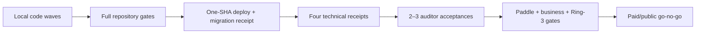

# Production readiness — Caisson

Live state, not historical optimism. “Healthy” means an endpoint answered; “parity” means the
deployed artifact is tied to the same approved immutable source revision. Paid launch remains
blocked until both technical and operator evidence is attached.

## Verdicts

| Dimension               | Verdict                                          | Current state                                                                                                                            |
| ----------------------- | ------------------------------------------------ | ---------------------------------------------------------------------------------------------------------------------------------------- |
| Repository              | **local gates green**                            | 81 Bun workspaces; 224/224 tasks, 904 site tests, and 76 package gates pass; field-crypto KMS remains outside main for fresh review      |
| Deploy / infrastructure | **red parity**                                   | Public probes answer, but license and admin manifest digests differ from repository/Worker                                               |
| Security                | **gaps**                                         | Limiter and provider adapters are implemented; four production technical receipts remain                                                 |
| Commerce                | **blocked**                                      | Sandbox built; Paddle production approval/catalog and real transaction proof absent                                                      |
| Operations              | **gaps**                                         | Restore rehearsed July 11; current backup recency and provider-console checks still required                                             |
| Buyer/product           | **local build complete; unproven in production** | Design-manifest residual and all four locked families closed 2026-07-25, verified in the merged tree; none have a deployed probe receipt |
| Release                 | **blocked**                                      | 49 pending changesets; no current CI/release certification or immutable tag-to-bytes receipt                                             |

## Evidence snapshot

### Repository and quality

- Remote reconciliation base: `origin/main` at `2efeea98`. Local `main` adds the validated writing
  surface, OSCAL spine/catalog, Ask AI evidence, and two independently verified supply-chain pins.
- `bun run check` passed 224/224 tasks on the integrated writing-plus-OSCAL tree, including 904
  site tests and 76 conforming package-gate checks.
- Dependency-cruiser false green is repaired in `c236681f`: TypeScript 6.0.3, 2,296 modules,
  1,630 TypeScript modules, 6,514 dependency edges, and `.ts`/`.tsx` sentinels.
- Total price authority is enforced in `f6122de8`, with the catalog type restored in
  `92d930b6`.
- Route-specific limiter infrastructure failures are enforced in `014ac4de`.
- Dependency-patch ownership is enforced by the audit harness in `3e384bc5`.
- `bun run sot` content gates are green. Its branch-hygiene advisory remains intentionally red
  because recovery refs and operator-owned wave worktrees are preserved rather than destructively
  cleaned.
- There are 49 pending changeset files. Current resolution affects 58 patch packages, 12 minor
  packages, and 2 major packages.
- Private-repository access has been authorized since 2026-06-30 (`gh auth status`: active
  `repo`-scoped token; `caisson-sh/caisson` confirmed private). Branch protection stays
  discipline-only on the Free plan (ADR-0327) and org 2FA was declined 2026-07-15, re-raise at
  launch — both accepted residuals. Current PRs, Actions, releases, and public-repository timing
  were last broadly certified in
  [2026-07-25 GitHub certification](../../outputs/executions/2026-07-25-github-certification.md).
  That pass found an open-PR CI defect; its appended correction records the resolution — the three
  PRs it named (#332, #333, #334) carried a fully green rollup and have since merged, as have
  #335-#340. The unsigned-tag defect stands but is no longer an open question: ADR-0382 lock 2
  locked SSH signing going forward with an advisory readiness check. The current seven-PR cutoff
  and local dispositions are in the
  [2026-07-27 reconciliation](../../outputs/executions/2026-07-27-project-reconciliation.md);
  older GitHub tables are historical.

### Deploy and parity

The current registry parity probe reports:

| Leg                                  | Digest                                    | State               |
| ------------------------------------ | ----------------------------------------- | ------------------- |
| Repository index                     | `74e92a6813bc` — 53 entries               | OK                  |
| Registry Worker                      | 17 served entries match repository latest | OK                  |
| License service                      | `09adca8d32a5`                            | **DRIFT**           |
| Admin                                | `97b183902c08`                            | **DRIFT**           |
| Latest recorded site-only deployment | source `ea2bee11`, Railway `3120a2ef`     | not a fleet receipt |

Docs-RAG and support-bot source parity remain uncertified. Migration `0030` is authored but has no
production-apply receipt. Exit requires all six runtime legs built from one approved SHA, manifest
digest parity, and health/checkout/entitlement/refund/RAG/support probe receipts.

### Commerce

- The target catalog is 36 products and 68 prices, including 27 module SKUs.
- Compliance’s operative displayed price is $1,649; Everything is $2,259.
- Production Paddle approval, product/price IDs, adjustment handling, dunning cancellation, and
  live checkout/refund/entitlement proof remain open.
- Dedicated refund/support routes merged in #333, and the OSCAL wave updates the mapping exporter
  to the exact 36-product/68-price target. They are still not production evidence, because nothing
  has been deployed or probed since. No live Paddle catalog mutation or production ID wiring has
  occurred.
- Fulfillment must recognize every current SKU and continue to reject unknown IDs.
- EIN is complete; it is no longer a blocker.
- Marketing remains public. Cart, dashboard, and checkout remain Cloudflare-gated.

### Security and technical acceptance

Implemented locally:

- Paddle webhook continues through limiter-infrastructure failure and emits a redacted operational
  alert.
- Issuer, admin, and evaluation routes return 503 on limiter-infrastructure failure.

Still required before paid launch:

1. COMPLIANCE-mode WORM receipt.
2. Deployed-pooler RLS receipt.
3. Split-brain recovery receipt.
4. KMS-signing receipt.
5. Independent security/conformance review of Inngest, Azure Key Vault, and Azure Blob adapters.
6. Two or three working-auditor acceptance reviews.

### Operations

Run the seven Gate D provider-console checks — [provider-console-checks](../ops/provider-console-checks.md)
— plus regenerate the dead `OPENROUTER_MANAGEMENT_KEY` (401s today; regeneration restores
per-key usage/attribution for the six per-service inference keys, per
[infra-provider-audit-2026-07-16](../../outputs/research/infra-provider-audit-2026-07-16.md) M2).
Arm anchoring only after its scheduler and TSA/Rekor/OTS egress ledger are ready.

### Buyer/product residuals

Completed locally: generated 39-component design-system manifest, byte drift guard, and
single-source browser-rendered contrast checks.

**All four remaining residuals closed 2026-07-25** — verified in the merged tree, not inferred from
the PR titles:

1. Module-depth pages for access-review, risk-register, and trust-page — records present in
   `apps/site/lib/module-pages.ts` (#332).
2. Admin chain viewer with proof details and redacted export — `apps/admin/src/app/api/admin/audit/`
   `{proof,export}/route.ts` plus the internal proof seam at `api/internal/audit/proof` (#335).
3. Tenant self-service proof route with dashboard integration — `apps/site/app/api/audit/proof/`
   `route.ts` and `app/dashboard/evidence/page.tsx` (#335).
4. Buyer crosswalk matrix — `apps/site/components/tenant-evidence-dashboard.tsx` via
   `mapBuyerCrosswalk(latestPack.manifest)`, with `maps-to` and `implements` rendered as separately
   labeled edge kinds and never summed into one coverage figure, per ADR-0380 lock 3 (#335).

The evidence-export path these ship on was reshaped in the same wave by **ADR-0385**: the pack
carries no executable verifier, verification moves to the out-of-band `@caisson/verify-pack`, and
exports emit only fields their event schema names (fail closed).

`substrate.field-crypto-policy` is no longer open — ADR-0381 drafted and locked its canonical
control content, resolving the binding the collector shipped without.

## Go/no-go sequence

No local green check substitutes for GitHub CI evidence, production parity, the four technical
receipts, independent acceptance, or the operator’s commerce/business decision.
