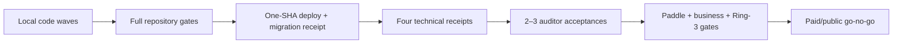

# Production readiness — Caisson

Live state, not historical optimism. “Healthy” means an endpoint answered; “parity” means the
deployed artifact is tied to the same approved immutable source revision. Paid launch remains
blocked until both technical and operator evidence is attached.

## Verdicts

| Dimension               | Verdict                                         | Current state                                                                                                          |
| ----------------------- | ----------------------------------------------- | ---------------------------------------------------------------------------------------------------------------------- |
| Repository              | **baseline green; branch verification pending** | 79 Bun workspaces; dependency/price/limiter repairs landed locally; final format/full-check and GitHub evidence remain |
| Deploy / infrastructure | **red parity**                                  | Public probes answer, but license and admin manifest digests differ from repository/Worker                             |
| Security                | **gaps**                                        | Limiter policy implemented; four technical receipts and three adapter audits remain                                    |
| Commerce                | **blocked**                                     | Sandbox built; Paddle production approval/catalog and real transaction proof absent                                    |
| Operations              | **gaps**                                        | Restore rehearsed July 11; current backup recency and provider-console checks still required                           |
| Buyer/product           | **gaps**                                        | Design-manifest residual complete; four already-locked families remain                                                 |
| Release                 | **blocked**                                     | 33 pending changesets; no current CI/release certification or immutable tag-to-bytes receipt                           |

## Evidence snapshot

### Repository and quality

- Baseline audited `main`: `fe2dfacaa2693578f49baf431f6d0865486174a6`.
- `bun run check` passed all 218 tasks at baseline.
- Dependency-cruiser false green is repaired in `c236681f`: TypeScript 6.0.3, 2,296 modules,
  1,630 TypeScript modules, 6,514 dependency edges, and `.ts`/`.tsx` sentinels.
- Total price authority is enforced in `f6122de8`, with the catalog type restored in
  `92d930b6`.
- Route-specific limiter infrastructure failures are enforced in `014ac4de`.
- Dependency-patch ownership is enforced by the audit harness in `3e384bc5`.
- There are 33 pending changeset files. Current resolution affects 41 patch packages and 4 minor
  packages.
- Current GitHub PRs, Actions, releases, required-check evidence, 2FA, and branch posture are
  **uncertified** until private-repository authorization exists. Older GitHub tables are historical.

### Deploy and parity

The current registry parity probe reports:

| Leg                                  | Digest                                    | State               |
| ------------------------------------ | ----------------------------------------- | ------------------- |
| Repository index                     | `74e92a6813bc` — 53 entries               | OK                  |
| Registry Worker                      | 17 served entries match repository latest | OK                  |
| License service                      | `09adca8d32a5`                            | **DRIFT**           |
| Admin                                | `97b183902c08`                            | **DRIFT**           |
| Latest recorded site-only deployment | source `ea2bee11`, Railway `3120a2ef`     | not a fleet receipt |

Docs-RAG and support-bot source parity remain uncertified. Migration `0030` is authored but has no
production-apply receipt. Exit requires all six runtime legs built from one approved SHA, manifest
digest parity, and health/checkout/entitlement/refund/RAG/support probe receipts.

### Commerce

- The target catalog is 35 products and 66 prices, including 26 module SKUs.
- Compliance’s operative displayed price is $1,449.
- Production Paddle approval, product/price IDs, adjustment handling, dunning cancellation, and
  live checkout/refund/entitlement proof remain open.
- Fulfillment must recognize every current SKU and continue to reject unknown IDs.
- EIN is complete; it is no longer a blocker.
- Marketing remains public. Cart, dashboard, and checkout remain Cloudflare-gated.

### Security and technical acceptance

Implemented locally:

- Paddle webhook continues through limiter-infrastructure failure and emits a redacted operational
  alert.
- Issuer, admin, and evaluation routes return 503 on limiter-infrastructure failure.

Still required before paid launch:

1. COMPLIANCE-mode WORM receipt.
2. Deployed-pooler RLS receipt.
3. Split-brain recovery receipt.
4. KMS-signing receipt.
5. Independent security/conformance review of Inngest, Azure Key Vault, and Azure Blob adapters.
6. Two or three working-auditor acceptance reviews.

### Operations

Verify current Railway backup recency, Arnica, Grafana quota, Blacksmith minutes, DMARC, vault/key
parity, Bedrock access, launch `SESSION_TOKEN_HMAC_KEY`, and removal of the dead OpenRouter
management key. Arm anchoring only after its scheduler and TSA/Rekor/OTS egress ledger are ready.

### Buyer/product residuals

Completed locally: generated 39-component design-system manifest, byte drift guard, and
single-source browser-rendered contrast checks.

Still open:

1. Three module-depth pages for access-review, risk-register, and trust-page.
2. Admin chain viewer row status, proof details, provenance, redacted export, and redaction count.
3. Tenant self-service proof route with dashboard/demo integration.
4. Buyer-dashboard crosswalk matrix.

`substrate.field-crypto-policy` is explicitly open. No canonical control content or public claim is
authorized until the operator locks it.

## Go/no-go sequence

No local green check substitutes for GitHub CI evidence, production parity, the four technical
receipts, independent acceptance, or the operator’s commerce/business decision.
